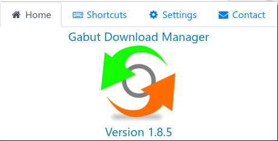
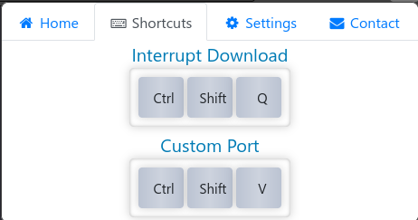
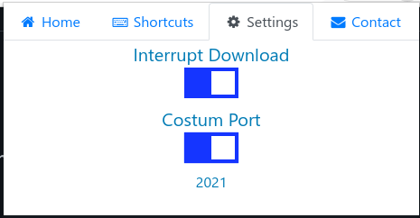
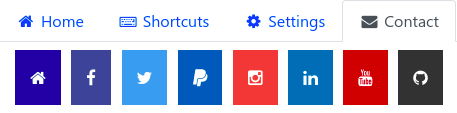

# Gabut Extensions For Firefox

<h1 align="center">
     
    
</h1>
<h4 align="center">Extensions for Gabut Download Manager</h4>
<h4 align="center">Now Available On Add-ons</h4>

    

<h1 align="center">🤩 Integration for Gabut Download manager 🤩</h1>

    

    

    

    

